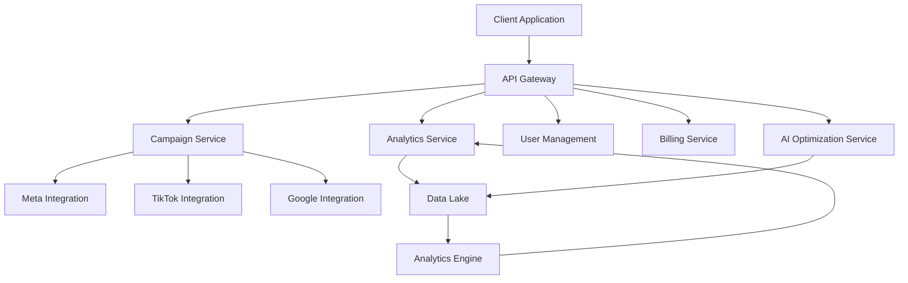
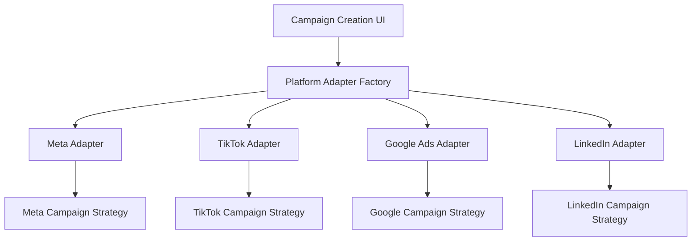
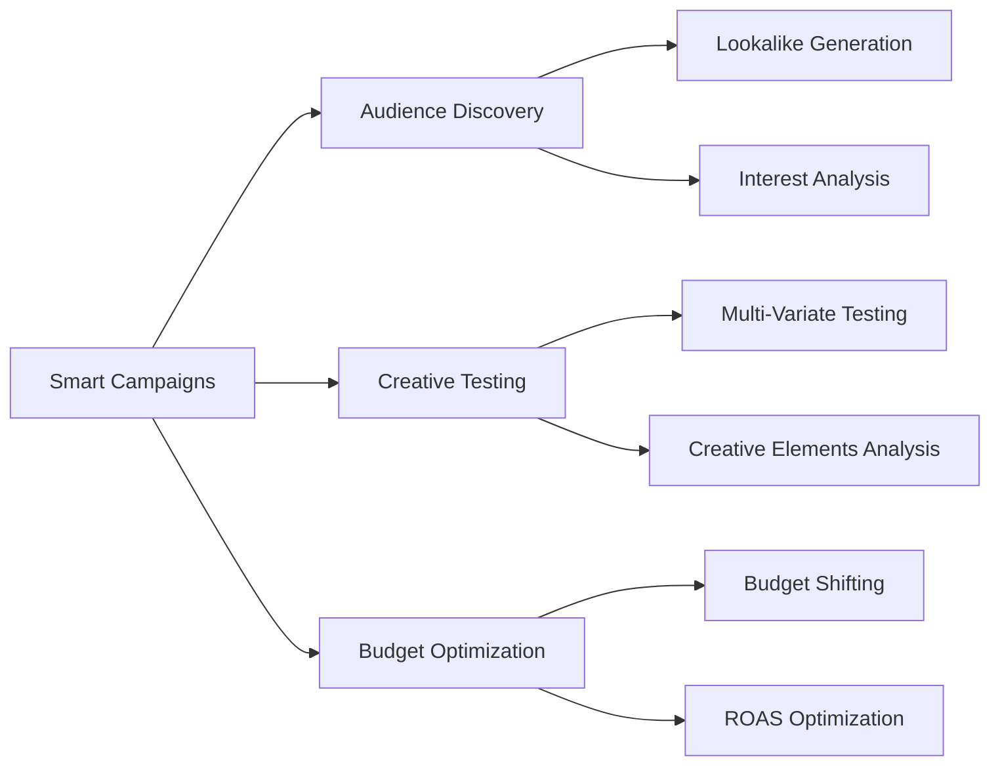
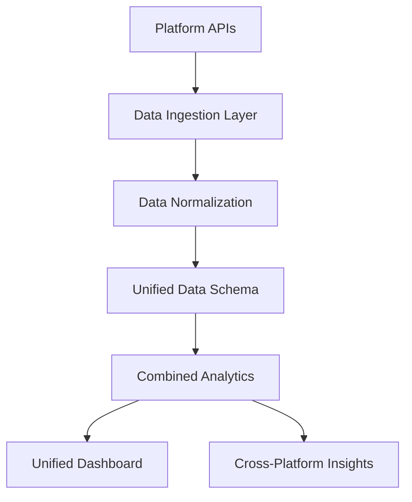

# DeepVisor 🚀

<div align="center">
  <h3>Digital Advertising Platform Project</h3>
  <p><i>A work-in-progress learning project with startup aspirations</i></p>
</div>

## Project Overview

DeepVisor is an in-development platform that aims to simplify digital advertising management across multiple platforms. As a college project focused on learning modern web development and API integration, it serves both as a practical education in software engineering and a potential startup concept.

**Current Status**: Early development with Meta API integration in progress.

### Vision

The vision for DeepVisor is to create a unified dashboard where users can:
- Create and manage ad campaigns across multiple platforms
- View normalized performance metrics in one place
- Leverage AI for campaign optimization and budget allocation
- Generate client-friendly reports and analytics

### Tech Stack

- **Frontend**: Next.js 15+ with Mantine UI
- **Backend**: Next.js API routes with Node.js
- **Database & Auth**: Supabase (PostgreSQL + Authentication)
- **API Integrations**: Meta Marketing API (in progress)

## Current Implementation

### Meta Integration (In Progress)

The current focus is on implementing Meta (Facebook & Instagram) ad campaign creation:

- ✅ OAuth authentication with Meta Business accounts
- ✅ Campaign builder UI with form validation
- 🔄 Campaign creation API integration
- 🔄 Strategy Pattern for flexible campaign parameters
- ⬜ Reporting and analytics

### Code Architecture

We're implementing the Strategy Pattern for flexible campaign parameter building:

```typescript
// Example of Strategy Pattern implementation
export async function createCreative(params: MetaCreativeParams): Promise<string> {
  // Get the appropriate strategy based on campaign objective
  const strategy = getCreativeStrategy(formData.objective);
  
  // Apply the strategy to get objective-specific parameters
  const creativeParams = strategy.buildCreativeParams(
    baseParams, 
    formData, 
    pageId,
    isSmartCampaign,
    creativeVariation
  );
  
  // API call with the parameters
  // ...
}
```

## Future Development Plans

While currently focused on Meta integration, the project has ambitious plans for expansion:

### System Architecture Vision



### Development Roadmap

```
┌─────────────────────┐    ┌─────────────────────┐    ┌─────────────────────┐
│     Current State   │ -> │  Near-Term Goals    │ -> │ Long-Term Vision    │
├─────────────────────┤    ├─────────────────────┤    ├─────────────────────┤
│ • Meta Integration  │    │ • Enhanced Smart    │    │ • Full AI-Powered   │
│   (in progress)     │    │   Campaigns         │    │   Media Buying      │
│ • Basic Campaign UI │    │ • Multi-Platform    │    │ • Budget Management │
│ • Strategy Pattern  │    │   Campaigns         │    │   Across Platforms  │
└─────────────────────┘    │ • Unified Analytics │    │ • Creative Testing  │
                           └─────────────────────┘    └─────────────────────┘
```

### Multi-Platform Strategy

The architectural plan includes a Platform Adapter pattern to support multiple advertising platforms:



### Smart Campaigns Feature Plan

Future versions aim to implement AI-powered campaign optimization:



### Analytics Vision

The planned analytics system will unify data from multiple platforms:



## Learning Goals

This project serves as a practical application of:

1. **Modern Web Development**
   - Next.js framework with React
   - Mantine UI component library
   - Server-side rendering and API routes

2. **Database Design**
   - Supabase PostgreSQL schema design
   - Authentication and authorization
   - Data relationships for complex ad structures

3. **External API Integration**
   - OAuth flows and token management
   - Campaign creation via Meta Marketing API
   - Error handling and rate limiting

4. **Design Patterns**
   - Strategy Pattern for flexible parameter building
   - Adapter Pattern for platform-agnostic interfaces
   - Factory Pattern for strategy creation

5. **System Architecture**
   - Planning scalable systems
   - Designing for future expansion
   - API design best practices

## Project Scope

As a learning project with startup potential, DeepVisor focuses on:

1. **Technical Implementation**: Building a functional system that integrates with ad platforms
2. **Architecture Design**: Creating a foundation that can scale with additional features
3. **Software Engineering Practice**: Following best practices for code organization and patterns
4. **User Experience**: Designing intuitive interfaces for complex advertising tasks

## About the Developer

I'm a college student developing DeepVisor to enhance my software engineering skills while exploring the digital advertising market. The project represents both a learning journey and a potential business idea.

For questions or collaboration opportunities, feel free to contact me at yengnerb475@gmail.com.

---

<div align="center">
  <p>© 2023 DeepVisor - A Software Engineering Learning Project</p>
</div>
