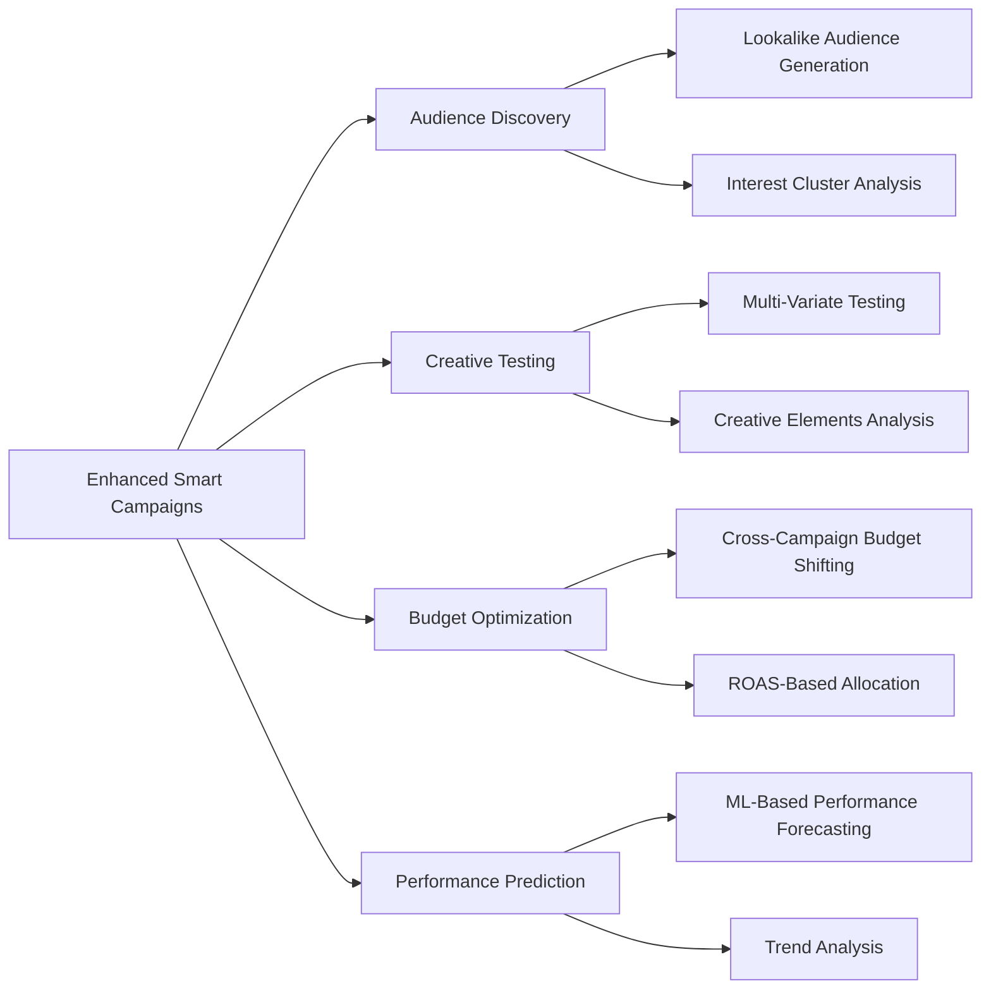
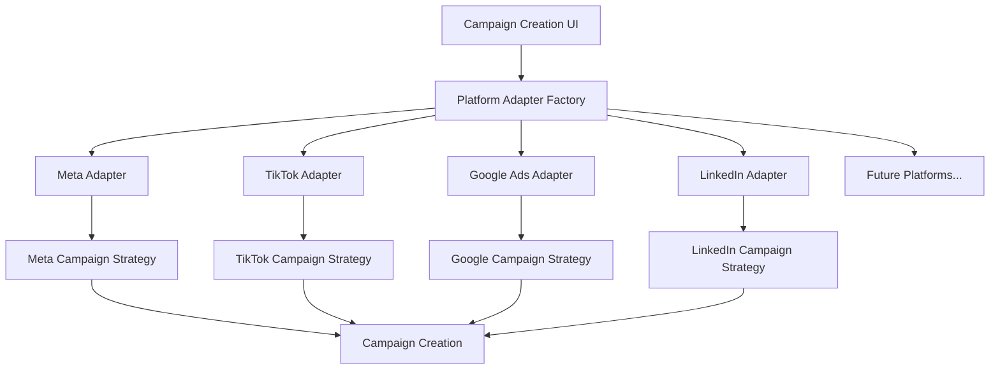
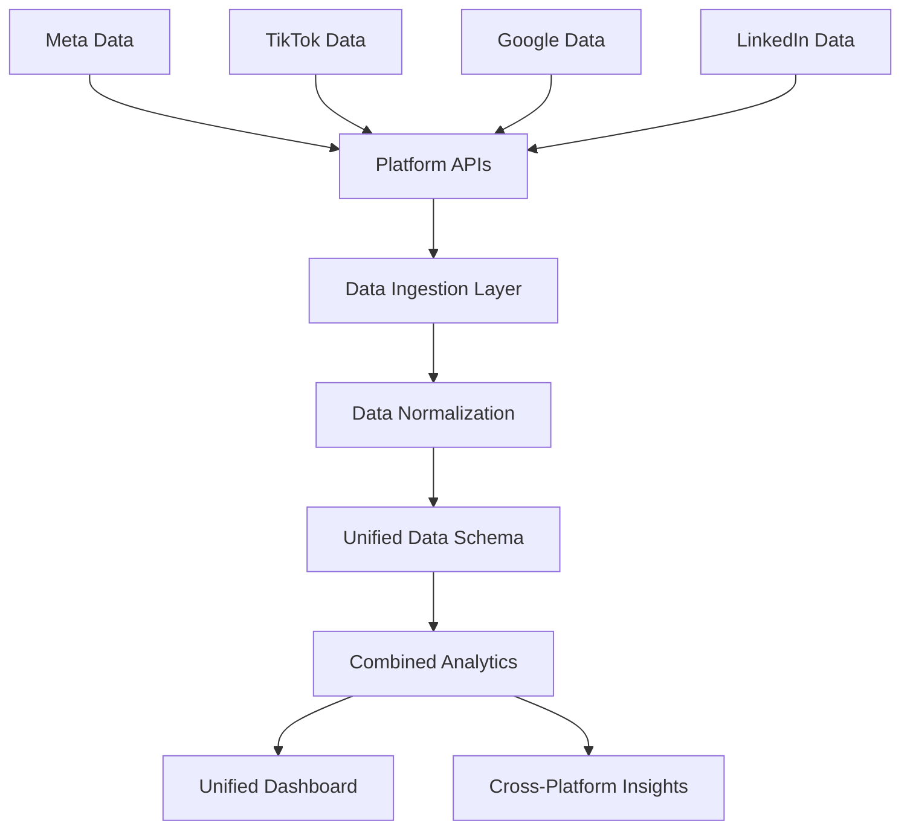

# **DeepVisor** 🚀
### **All-in-One Advertising Platform & Agency Companion**

DeepVisor is a SaaS solution that helps **individuals and businesses** manage advertising across multiple networks, including **Meta (Facebook & Instagram), TikTok, Google Ads, Reddit, YouTube, and more**. The platform is built to work alongside our advertising agency, giving clients transparent access to campaign results while also generating leads for the agency itself.

Users can **integrate, track, analyze, and optimize ad campaigns** from one dashboard. DeepVisor offers automation tools, AI-driven suggestions, and unique marketing utilities like scannable barcodes that link to a business hub and the option to add a digital business card to **Apple Wallet**.

With the recent addition of the `/public/proposal/[token]` page, clients will receive proposal links via email. Visiting this link opens a public proposal page where they can approve the proposal or request revisions (functionality in progress).

This README outlines the current workflow, database structure, and features planned for future development.

# DeepVisor: Future Implementation Roadmap

## Overview

This document outlines the future development roadmap for DeepVisor, focusing on advanced campaign management features, multi-platform capabilities, and AI-powered optimization.

```
┌─────────────────────┐    ┌─────────────────────┐    ┌─────────────────────┐
│     Current State   │ -> │  Near-Term Goals    │ -> │ Long-Term Vision    │
├─────────────────────┤    ├─────────────────────┤    ├─────────────────────┤
│ • Meta Integration  │    │ • Enhanced Smart    │    │ • Full AI-Powered   │
│ • Basic Campaigns   │    │   Campaigns         │    │   Media Buying      │
│ • Simple Reporting  │    │ • Multi-Platform    │    │ • Budget Management │
│ • Strategy Pattern  │    │   Campaigns         │    │   Across Platforms  │
└─────────────────────┘    │ • Unified Analytics │    │ • Creative Testing  │
                           └─────────────────────┘    │   At Scale          │
                                                      └─────────────────────┘
```

## Smart Campaign Enhancements

### Current Implementation
Our current Smart Campaigns offer basic AI-powered targeting and creative optimization for Meta.

### Future Smart Campaign Features



#### Planned Improvements:

1. **Advanced Audience Discovery**
   - Automatic audience segmentation based on performance data
   - AI-generated lookalike audiences across platforms
   - Interest and behavior prediction engine

2. **Sophisticated Creative Testing**
   - Multi-variate testing beyond simple A/B testing
   - Creative element isolation (headline vs. image vs. CTA)
   - Automatic creative generation using generative AI

3. **Dynamic Budget Management**
   - Real-time budget shifting between campaigns and platforms
   - Predictive budget allocation based on forecasted performance
   - ROAS-based spend optimization

4. **Technical Implementation**
   - Enhanced strategy patterns for complex optimization logic
   - AI model integration for performance prediction
   - Real-time feedback loops for continuous improvement

## Multi-Platform Campaign Creation

### Architecture



### Implementation Plan

The multi-platform campaign creation will follow these principles:

1. **Platform Adapter Pattern**
   - Create standardized interfaces for each platform
   - Platform-specific adapters handle API differences
   - Common campaign models translated to platform-specific parameters

2. **Unified Campaign Flow**
   ```typescript
   // Example Multi-Platform Campaign Creation
   export async function createMultiPlatformCampaign(formData: MultiPlatformCampaignValues): Promise<MultiCampaignResult> {
     const platforms = formData.selectedPlatforms; // e.g., ['meta', 'tiktok']
     const results = {};
     
     for (const platform of platforms) {
       const adapter = getPlatformAdapter(platform);
       const platformFormData = adapter.transformFormData(formData);
       results[platform] = await adapter.createCampaign(platformFormData);
     }
     
     // Create unified campaign record in database
     const unifiedCampaign = await createUnifiedCampaignRecord(results, formData);
     
     return {
       unifiedCampaignId: unifiedCampaign.id,
       platformResults: results
     };
   }
   ```

3. **Similar Campaign Types Across Platforms**
   - Map objectives between platforms (e.g., Meta's "LEAD_GENERATION" to TikTok's "LEAD_GENERATION")
   - Translate targeting parameters to each platform's requirements
   - Adapt creative assets to platform-specific formats and requirements

4. **Synchronized Campaign Management**
   - Status synchronization (pause/activate across platforms)
   - Budget adjustments proportionally across platforms
   - Performance data consolidation

## Unified Analytics and Reporting



### Features

1. **Combined Campaign Performance View**
   - Aggregated metrics across platforms (impressions, clicks, conversions)
   - Side-by-side platform comparison
   - Attribution modeling across platforms

2. **Unified Cost Analysis**
   - Total campaign spend across platforms
   - Cost per result metrics normalized across platforms
   - Budget utilization and efficiency insights

3. **Cross-Platform Audience Insights**
   - Audience overlap analysis
   - Platform-specific audience performance
   - Demographic performance comparison

4. **Custom Report Builder**
   - User-configurable reports spanning multiple platforms
   - Scheduled report delivery
   - Export capabilities in multiple formats

## Expansion to Additional Platforms

<!-- ### Integration Roadmap

```mermaid
gantt
    title Platform Integration Roadmap
    dateFormat  YYYY-MM-DD
    
    section Current
    Meta Integration    :done, meta1, 2025-07-01, 90d
    
    section Phase 1
    TikTok Integration  :tiktok, 2023-10-15, 60d
    Google Ads Basic    :google1, 2023-12-01, 75d
    
    section Phase 2
    LinkedIn Ads        :linkedin, 2024-02-15, 60d
    Google Ads Advanced :google2, 2024-03-01, 90d
    
    section Phase 3
    Twitter Ads         :twitter, 2024-06-01, 60d
    Pinterest Ads       :pinterest, 2024-07-15, 60d
    Snapchat Ads        :snap, 2024-09-01, 60d
    
    section Future
    Reddit Ads          :reddit, 2025-01-01, 60d
    Programmatic/DSP    :dsp, 2025-03-01, 120d
``` -->

### Platform-Specific Features

Each platform integration will include:

1. **Authentication and Connection**
   - OAuth flow implementation
   - Token management and refresh
   - Permission scoping

2. **Campaign Creation Flows**
   - Platform-specific campaign builders
   - Objective mapping between platforms
   - Format adaptation for creatives

3. **Platform-Specific Optimizations**
   - Custom strategies per platform
   - Platform-specific targeting capabilities
   - Performance benchmarks relevant to each platform

## Technical Architecture

### System Design

The enhanced DeepVisor platform will be built on a microservices architecture:

```mermaid
graph TD
    A[Client Application] --> B[API Gateway]
    
    B --> C[Campaign Service]
    B --> D[Analytics Service]
    B --> E[User Management]
    B --> F[Billing Service]
    B --> G[AI Optimization Service]
    
    C --> H[Meta Integration]
    C --> I[TikTok Integration]
    C --> J[Google Integration]
    
    D --> K[Data Lake]
    G --> K
    
    K --> L[Analytics Engine]
    L --> D
    
    G --> M[ML Pipeline]
    M --> G
```

### Implementation Challenges and Solutions

1. **API Inconsistency Between Platforms**
   - **Challenge**: Each advertising platform has different API structures, parameters, and limitations
   - **Solution**: Adapter pattern with platform-specific implementations behind common interfaces

2. **Data Normalization**
   - **Challenge**: Metrics and dimensions vary across platforms
   - **Solution**: Standardized data schema with platform-specific transformers

3. **Authentication and Permission Management**
   - **Challenge**: Different OAuth flows and permission models
   - **Solution**: Unified authentication service with platform-specific handlers

4. **Rate Limiting and API Quotas**
   - **Challenge**: Each platform has different rate limits and quotas
   - **Solution**: Queue-based architecture with backoff strategies and quota monitoring

5. **Keeping Up With Platform Changes**
   - **Challenge**: Ad platforms frequently update their APIs
   - **Solution**: Versioned adapters and automated tests for platform compatibility

## Development Approach

1. **Phased Implementation**
   - Start with core platform extensions (Meta + TikTok)
   - Add Google Ads integration in second phase
   - Expand to other platforms based on user demand

2. **Modular Architecture**
   - Core services independent of specific platforms
   - Platform-specific modules that can be developed and deployed independently
   - Clear interfaces between systems

3. **Testing Strategy**
   - Comprehensive unit tests for platform adapters
   - Integration tests with platform sandbox environments
   - End-to-end testing of multi-platform campaigns

4. **Continuous Deployment**
   - Feature flags for gradual rollout
   - A/B testing for new optimization strategies
   - Monitoring and alerting for platform-specific issues

## Getting Involved

Interested in contributing to these future implementations? Contact me at yengnerb@deepvisor.com 