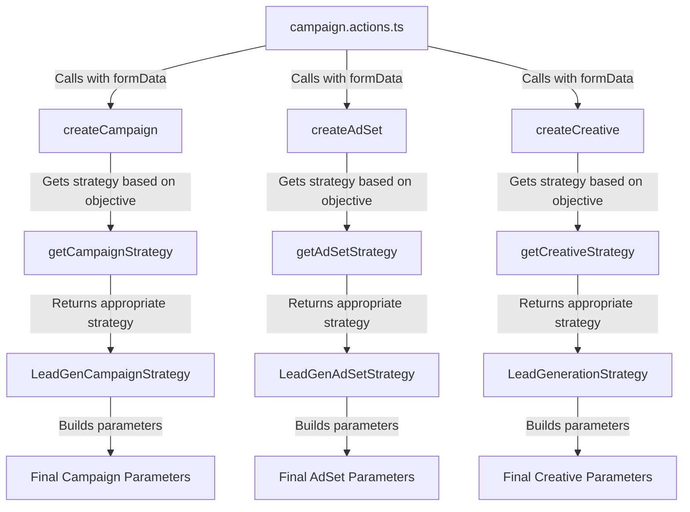

# Meta Marketing Api
Hi, lets first strat of with the Overview of how meta allows programable access to its marketing api and there main operations.

## Overview
Meta's Marketing API allows developers to programmatically manage advertising campaigns, ad sets, and ads on the Meta platform (formerly Facebook). The API provides endpoints for creating, reading, updating, and deleting advertising objects, as well as retrieving insights and analytics data.

"One of the primary features of the Marketing API is its ability to facilitate the automated creation of ads. You can programmatically generate ad campaigns, ad sets, and individual ads, allowing for rapid deployment and iteration based on real-time performance data. This automation also enables businesses to reach larger audiences with greater efficiency.

In addition to ad creation, you can:

Update, pause, or delete ads seamlessly
Ensure that campaigns remain aligned with business objectives
Access detailed insights and analytics to track ad performance and make data-driven decisions to improve outcomes"

https://scontent-mia3-2.xx.fbcdn.net/v/t39.8562-6/465922728_1274126690433578_4616558889838468033_n.png?_nc_cat=103&ccb=1-7&_nc_sid=f537c7&_nc_ohc=JhUzjmt06U4Q7kNvwG7RN1Y&_nc_oc=AdmkcHISvzRv00wH8UdOhLQTh661rvlFLJ3cFozHq0AdtjqHIBn6zCeZJEQ9yrWX8Eg&_nc_zt=14&_nc_ht=scontent-mia3-2.xx&_nc_gid=HDQskSi4X1RPMzBLP1yKAQ&oh=00_AfOOyErUDSeevCQN_pnR-h5maDY3WMLGG7uu20PzRT3WhA&oe=686DB965

Documentation Link: https://developers.facebook.com/docs/marketing-apis/overview


## Basic Operations
Creating ads using the Marketing API involves a systematic approach that includes setting up campaigns, ad sets, and ad creatives. This document provides detailed guidance on programmatically creating these components, along with code samples to illustrate the implementation process.

### 1. Create a Campaign
**The campaigns endpoint**: The campaigns endpoint is used to create and manage advertising campaigns. This endpoint allows users to set the overall objectives for their marketing efforts, such as brand awareness or conversions.

```curl -X POST \
  https://graph.facebook.com/v23.0/act_<AD_ACCOUNT_ID>/campaigns \
  -F 'name=My Campaign' \
  -F 'objective=LINK_CLICKS' \
  -F 'status=PAUSED' \
  -F 'access_token=<ACCESS_TOKEN>'
  ```

### 2. Create an Ad Set
**The ad sets endpoint**: The adsets endpoint organizes ads within campaigns based on specific targeting criteria and budget allocation. This allows for more granular control over audience targeting and spending.

``` curl -X POST \
  https://graph.facebook.com/v23.0/act_<AD_ACCOUNT_ID>/adsets \
  -F 'name=My Ad Set' \
  -F 'campaign_id=<CAMPAIGN_ID>' \
  -F 'daily_budget=1000' \
  -F 'targeting={"geo_locations":{"countries":["US"]}}' \
  -F 'access_token=<ACCESS_TOKEN>'
```

### 3. Create an Ad Creative
**The ad creatives endpoint**: The ads endpoint is where the actual advertisements are created, allowing you to define creative elements and link them to the appropriate ad set.

``` curl -X POST \
  https://graph.facebook.com/v23.0/act_<AD_ACCOUNT_ID>/ads \
  -F 'name=My Ad' \
  -F 'adset_id=<AD_SET_ID>' \
  -F 'creative={"creative_id": "<CREATIVE_ID>"}' \
  -F 'status=ACTIVE' \
  -F 'access_token=<ACCESS_TOKEN>'
``` 

Documentation link: https://developers.facebook.com/docs/marketing-api/get-started/basic-ad-creation


# Strategy Pattern for Meta Campaign Creation

## Overview

This section explains the Strategy Pattern implementation for Meta Campaign creation, which allows for flexible, maintainable, and extensible code when handling different campaign objectives and types.

```
src/lib/actions/meta/
├── strategies/
│   ├── campaign/
│   │   ├── CampaignStrategy.ts             # Base strategy interface
│   │   ├── CampaignStrategyFactory.ts      # Factory to get appropriate strategy
│   │   ├── LeadGenCampaignStrategy.ts      # Lead generation specific strategy
│   │   ├── TrafficCampaignStrategy.ts      # Traffic specific strategy
│   │   └── EngagementCampaignStrategy.ts   # Engagement specific strategy
│   ├── adset/
│   │   ├── AdSetStrategy.ts                # Base strategy interface
│   │   ├── AdSetStrategyFactory.ts         # Factory to get appropriate strategy
│   │   ├── LeadGenAdSetStrategy.ts         # Lead generation specific strategy
│   │   └── TrafficAdSetStrategy.ts         # Traffic specific strategy
│   └── creative/
│       ├── CreativeStrategy.ts             # Base strategy interface
│       ├── CreativeStrategyFactory.ts      # Factory to get appropriate strategy
│       ├── LeadGenerationStrategy.ts       # Lead generation specific strategy
│       ├── TrafficStrategy.ts              # Traffic specific strategy
│       └── EngagementStrategy.ts           # Engagement specific strategy
├── helpers/
│   ├── apiHelpers.ts                       # Common API helper functions
│   └── creativeHelpers.ts                  # Helper functions for creative generation
└── campaign.actions.ts                     # Main orchestration file
```

## Strategy Pattern Implementation

The Strategy Pattern allows us to encapsulate different parameter building logic for different campaign types, making the code more maintainable and extensible.

### Key Components

1. **Strategy Interfaces**: Define the contract for all strategies
2. **Concrete Strategies**: Implement specific parameter logic for each campaign objective
3. **Strategy Factories**: Return the appropriate strategy based on the campaign objective
4. **Base Parameter Builders**: Create common parameters used by all strategies
5. **Main Action Functions**: Orchestrate the process using the appropriate strategies

## How It Works

### 1. Strategy Selection Process



### 2. Implementation Example

The main `createCreative` function now uses strategies to build parameters:

```typescript
// From createCreative.ts
export async function createCreative(params: MetaCreativeParams): Promise<string> {
  const { adAccountId, accessToken, pageId, formData, isSmartCampaign, creativeVariation = 0 } = params;

  try {
    // 1. Create base parameters common to all creatives
    let baseParams = createBaseCreativeParams(formData, pageId, isSmartCampaign, creativeVariation);

    // 2. Handle content source specific modifications
    // ...content source handling...

    // 3. Get the appropriate strategy based on campaign objective
    const strategy = getCreativeStrategy(formData.objective);

    // 4. Apply the strategy to get objective-specific parameters
    const creativeParams = strategy.buildCreativeParams(
      baseParams, 
      formData, 
      pageId,
      isSmartCampaign,
      creativeVariation
    );
    
    // 5. Add access token and call the API
    // ...API call handling...

    return creativeData.id;
  } catch (err) {
    // Error handling
    throw err;
  }
}
```

## Adding a New Campaign Objective

To add support for a new campaign objective, follow these steps:

1. **Create a New Campaign Strategy**:

```typescript
// src/lib/actions/meta/strategies/campaign/NewObjectiveStrategy.ts
import { CampaignStrategy } from "./CampaignStrategy";
import { CampaignFormValues } from "../../types";

export class NewObjectiveStrategy implements CampaignStrategy {
  buildCampaignParams(
    baseParams: any, 
    formData: CampaignFormValues, 
    isSmartCampaign: boolean
  ): any {
    // Start with base parameters
    const params = { ...baseParams };
    
    // Add objective-specific parameters
    params.objective = 'NEW_OBJECTIVE_TYPE';
    // Add other parameters specific to this objective
    
    return params;
  }
}
```

2. **Create a New Ad Set Strategy**:

```typescript
// Similar implementation for ad set strategy
```

3. **Create a New Creative Strategy**:

```typescript
// Similar implementation for creative strategy
```

4. **Update the Factory Methods**:

```typescript
// In the respective factory files, add the new strategy to the switch statement
export function getCreativeStrategy(objective: string): CreativeStrategy {
  switch (objective) {
    // Existing cases
    case 'NEW_OBJECTIVE_TYPE':
      return new NewObjectiveStrategy();
    default:
      return new DefaultStrategy();
  }
}
```

## Benefits of the Strategy Pattern

1. **Separation of Concerns**: Each objective's parameter logic is isolated in its own strategy class
2. **Clean Code**: Avoids large switch statements and complex conditional logic
3. **Easy to Extend**: Adding new campaign objectives just requires new strategy classes
4. **Maintainable**: Changes to Meta's API for specific campaign types only affect the relevant strategy classes
5. **Testable**: Each strategy can be unit tested in isolation

## API Parameter Flow

The following shows how parameters are built and passed through each layer:

```
FormData → StandardizedFormData → BaseParams → Strategy-Specific Params → API Call
```

Each strategy handles the specific parameter requirements for its campaign objective, ensuring that all required fields are properly set according to Meta's API specifications.