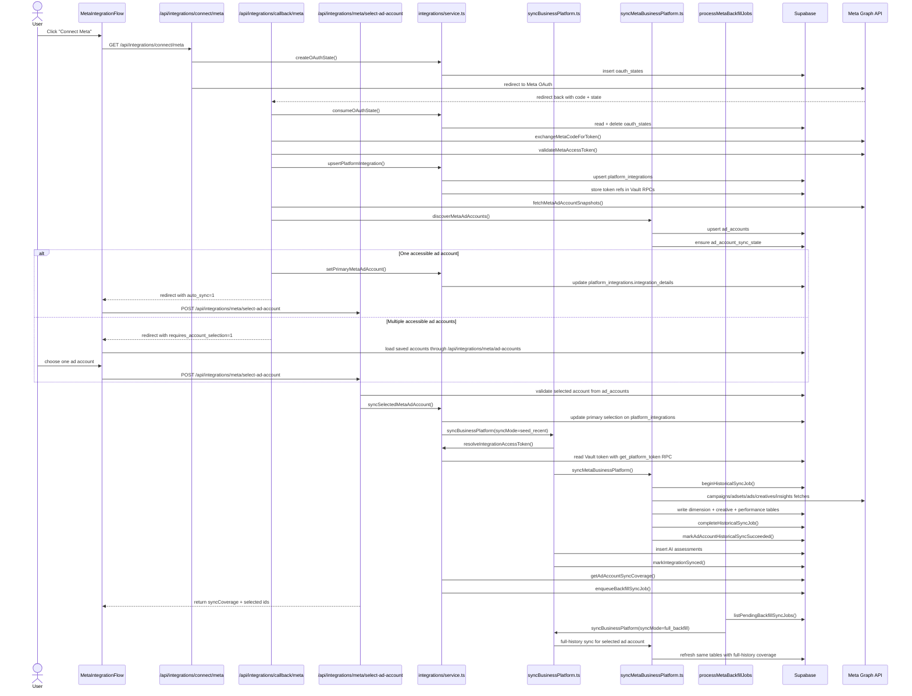

# Meta Integration, Account Selection, and Sync Flow

This document describes the current end-to-end Meta connection flow as implemented today.

It covers:

- how OAuth connect starts and completes
- how accessible ad accounts are discovered
- how one primary ad account is selected
- how the 90-day seed sync runs
- how the full-history backfill is queued and processed
- which functions are called
- which tables are written

## Current Product Rules

- Meta is the only supported integration platform right now.
- One `platform_integrations` row is treated as the active Meta connection for a business.
- One primary Meta ad account is selected per integration.
- Only the selected primary ad account is synced.
- OAuth discovery registers accessible accounts, but does not sync metrics for every account.
- The first sync is a recent-first seed sync for `90` days.
- Full history is queued as a background backfill after the seed sync finishes.
- The full-history request uses `FULL_HISTORY_BACKFILL_DAYS = 10000`, but Meta lookback is capped in code to `37` months.

## High-Level Sequence

## Client Flow

The client entry point is [`MetaIntegrationFlow.tsx`](../../components/integrations/MetaIntegrationFlow.tsx).

The client drives the integration UX from query params returned by the callback route:

- `integration=meta`
- `status=connected|error`
- `requires_account_selection=1`
- `integrationId=<platform_integrations.id>`
- `externalAccountId=<ad_accounts.external_account_id>` for the single-account auto-sync path
- `auto_sync=1` for the single-account auto-sync path

Current client behavior:

1. `connectMeta()` redirects the browser to `/api/integrations/connect/meta?returnTo=...`.
2. If the callback returns `status=error`, the client shows an error toast and exits the flow.
3. If the callback returns `requires_account_selection=1`, the client loads the saved account list from `/api/integrations/meta/ad-accounts`.
4. If the callback returns `auto_sync=1` and an `externalAccountId`, the client skips manual selection and immediately posts to `/api/integrations/meta/select-ad-account`.
5. After the seed sync succeeds, the client shows a success toast and refreshes into the app.

Important current behavior:

- The account picker route does not re-fetch accounts from Meta.
- The select-account route does not re-fetch accessible accounts from Meta.
- Both now trust server-side discovered state in `ad_accounts`.

## Route and Function Call Chain

### 1. Connect Route

Entry point:

- [`src/app/api/integrations/connect/[platform]/route.ts`](../../../app/api/integrations/connect/[platform]/route.ts)

Main functions:

- `parseSupportedIntegrationPlatform()`
- `sanitizeReturnTo()`
- `resolvePlatformByKey()`
- `createOAuthState()`
- `buildMetaOAuthUrl()`

What happens:

1. Validates the platform route segment.
2. Resolves the current user and business context.
3. Resolves the `platforms` row for Meta.
4. Inserts a one-time OAuth state row.
5. Builds the Meta OAuth URL and redirects the browser there.

Writes:

- `public.oauth_states`

### 2. OAuth Callback Route

Entry point:

- [`src/app/api/integrations/callback/[platform]/route.ts`](../../../app/api/integrations/callback/[platform]/route.ts)

Main functions:

- `consumeOAuthState()`
- `exchangeMetaCodeForToken()`
- `validateMetaAccessToken()`
- `upsertPlatformIntegration()`
- `fetchMetaAdAccountSnapshots()`
- `discoverMetaAdAccounts()`
- `setPrimaryMetaAdAccount()` for the single-account path
- `markIntegrationError()` on failure

What happens:

1. Validates the callback payload.
2. Consumes the saved OAuth state.
3. Exchanges the Meta code for an access token.
4. Validates that token.
5. Upserts the business Meta integration row.
6. Fetches accessible Meta ad accounts once.
7. Registers those accounts in DeepVisor without syncing metrics yet.
8. Redirects to:
   - manual account selection if multiple accounts exist
   - auto-sync if exactly one account exists

Important current behavior:

- The callback fetches accessible accounts once.
- It passes those snapshots into `discoverMetaAdAccounts()`.
- It does not queue a historical job for every discovered account.

Writes:

- `public.platform_integrations`
- Vault secret storage through `upsert_platform_token` RPC
- `public.ad_accounts`
- `public.ad_account_sync_state`

### 3. Account Picker Route

Entry point:

- [`src/app/api/integrations/meta/ad-accounts/route.ts`](../../../app/api/integrations/meta/ad-accounts/route.ts)

Main functions:

- `getBusinessIntegrationById()`
- `getPrimaryAdAccountSelection()`

What happens:

1. Validates the requested integration belongs to the current business.
2. Reads already-discovered account rows from `ad_accounts`.
3. Reads the saved primary selection from `platform_integrations.integration_details`.
4. Returns a normalized account list for the modal.

Important current behavior:

- This route reads only DeepVisor state.
- It does not call Meta again.

Reads:

- `public.platform_integrations`
- `public.ad_accounts`

### 4. Select Ad Account Route

Entry point:

- [`src/app/api/integrations/meta/select-ad-account/route.ts`](../../../app/api/integrations/meta/select-ad-account/route.ts)

Main functions:

- `getBusinessIntegrationById()`
- `getPrimaryAdAccountSelection()`
- `syncSelectedMetaAdAccount()`
- `applyAppSelectionCookies()`

What happens:

1. Validates the `integrationId` and `externalAccountId`.
2. Confirms the selected account exists in `ad_accounts` for this business and platform.
3. Falls back to the saved primary selection if the integration already points at the same external id.
4. Runs the seed sync via `syncSelectedMetaAdAccount()`.
5. Persists selection cookies for the active integration and ad account row.

Important current behavior:

- This route does not re-fetch accessible accounts from Meta.
- Validation is based on server-side discovered state.

Writes:

- `public.platform_integrations` via primary selection update
- response cookies: `platform_integration_id`, `ad_account_row_id`

## `syncSelectedMetaAdAccount()` Flow

Main file:

- [`src/lib/server/integrations/metaSelection.ts`](./metaSelection.ts)

Main functions:

- `setPrimaryMetaAdAccount()`
- `syncBusinessPlatform()`
- `getAdAccountSyncCoverage()`
- `enqueueBackfillSyncJob()`

What happens:

1. Saves the selected primary ad account on `platform_integrations.integration_details`.
2. Calls `syncBusinessPlatform()` with:
   - `trigger: 'integration'`
   - `syncMode: 'seed_recent'`
   - `backfillDays: 90`
3. Reads the synced `ad_accounts` row id.
4. Builds the `SyncCoverage` response for the client.
5. If full history is still pending, enqueues one backfill job for the selected account.

Writes:

- `public.platform_integrations`
- `public.account_sync_jobs` for queued backfill work

## `syncBusinessPlatform()` Flow

Main file:

- [`src/lib/server/sync/syncBusinessPlatform.ts`](../sync/syncBusinessPlatform.ts)

Main functions:

- `getBusinessPlatformIntegration()`
- `isSyncEligible()`
- `resolveIntegrationAccessToken()`
- `syncMetaBusinessPlatform()`
- `runMetaAdAccountAssessment()`
- `runBusinessAssessment()`
- `markIntegrationSynced()`
- `markIntegrationError()`

What happens:

1. Resolves the target Meta integration row.
2. Rejects syncs for ineligible integration states.
3. Loads the live access token from Vault with `get_platform_token`.
4. Resolves the primary external ad account id.
5. Runs the provider-specific Meta sync orchestration.
6. Runs post-sync assessments if the selected ad account row exists.
7. Marks the integration healthy on success.
8. Marks the integration as errored on failure.

Writes:

- `public.platform_integrations`
- `ai.business_assessments`

## `syncMetaBusinessPlatform()` Flow

Main file:

- [`src/lib/server/sync/meta/syncMetaBusinessPlatform.ts`](../sync/meta/syncMetaBusinessPlatform.ts)

Stage order:

1. resolve the selected primary ad account context
2. `ensureAdAccountSyncStates()`
3. `beginHistoricalSyncJob()`
4. `syncMetaCampaigns()`
5. `syncMetaAdsets()`
6. `syncMetaAds()`
7. `syncMetaAdCreatives()`
8. `syncMetaPerformance()`
9. `completeHistoricalSyncJob()`
10. `markAdAccountHistoricalSyncSucceeded()`

What happens:

1. Resolves the selected primary ad account before syncing.
2. For `seed_recent`, it reuses the already-registered `ad_accounts` row and skips a broad Meta rediscovery.
3. For later sync modes, it validates only the selected account against Meta and refreshes that account's metadata when needed.
4. Ensures sync-state rows exist for that account.
5. Opens or advances the historical sync job row.
6. Syncs campaign, ad set, ad, creative, and performance data for the selected account only.
7. Marks the job completed and updates sync coverage metadata.
8. On failure, marks the job failed.

Important current behavior:

- The initial seed sync no longer re-discovers all accessible Meta accounts.
- Later sync modes validate only the selected account instead of refetching the entire accessible account list.
- Only the selected primary account enters dimension/performance sync.
- Seed sync and full backfill use the same core path with different `syncMode` and date windows.

## Seed Sync vs Full Backfill

Seed sync:

- Triggered immediately after account selection.
- Uses `RECENT_SEED_SYNC_DAYS = 90`.
- Runs with `syncMode = 'seed_recent'`.
- Returns `SyncCoverage` to the client right away.

Full backfill:

- Queued after seed sync if `historicalAnalysisPending` is still true.
- Runs with `syncMode = 'full_backfill'`.
- Requests `FULL_HISTORY_BACKFILL_DAYS = 10000`.
- Meta date resolution caps that to the latest supported `37` months via `resolveMetaBackfillWindow()`.

## Background Backfill Processing

Route:

- [`src/app/api/integrations/meta/process-backfill-jobs/route.ts`](../../../app/api/integrations/meta/process-backfill-jobs/route.ts)

Worker function:

- [`src/lib/server/sync/meta/processBackfillJobs.ts`](../sync/meta/processBackfillJobs.ts)

Optional Supabase cron wrapper:

- [`supabase/functions/process_meta_backfill_jobs/index.ts`](../../../../supabase/functions/process_meta_backfill_jobs/index.ts)

Main functions:

- `listPendingBackfillSyncJobs()`
- `syncBusinessPlatform()`
- `failHistoricalSyncJob()`

What happens:

1. An internal route reads pending `backfill` jobs.
2. For each job, it resolves the selected ad account external id.
3. It reruns `syncBusinessPlatform()` in `full_backfill` mode.
4. Failures are persisted back onto the job row and sync-state row.

Operational notes:

- The internal route requires `INTERNAL_API_KEY`.
- The Supabase edge function can additionally enforce `CRON_SECRET`.

## Tables Written by Phase

| Phase | Main writer functions | Tables written |
| --- | --- | --- |
| OAuth start | `createOAuthState()` | `public.oauth_states` |
| OAuth callback integration save | `upsertPlatformIntegration()` | `public.platform_integrations` and Vault token RPC writes |
| Account discovery | `discoverMetaAdAccounts()`, `upsertAdAccounts()`, `ensureAdAccountSyncStates()` | `public.ad_accounts`, `public.ad_account_sync_state` |
| Primary account selection | `setPrimaryMetaAdAccount()` | `public.platform_integrations` |
| Sync job lifecycle | `beginHistoricalSyncJob()`, `completeHistoricalSyncJob()`, `failHistoricalSyncJob()`, `enqueueBackfillSyncJob()` | `public.account_sync_jobs`, `public.ad_account_sync_state` |
| Campaign sync | `syncMetaCampaigns()`, `upsertCampaignDims()` | `public.campaign_dims` |
| Ad set sync | `syncMetaAdsets()`, `upsertAdsetDims()` | `public.adset_dims` |
| Ad sync | `syncMetaAds()`, `upsertAdDims()` | `public.ad_dims` |
| Creative sync | `syncMetaAdCreatives()`, `upsertAdCreatives()` | `public.ad_creatives` |
| Creative AI feature extraction | `upsertCreativeFeatureSnapshots()` | `ai.creative_feature_snapshots` |
| Ad account performance rollup | `upsertAdAccountPerformanceDaily()` | `public.ad_accounts` updates `aggregated_metrics`, `time_increment_metrics`, `currency_code`, `updated_at` |
| Campaign daily performance | `upsertCampaignPerformanceDaily()` | `public.campaigns_performance_daily` |
| Ad set daily performance | `upsertAdsetPerformanceDaily()` | `public.adsets_performance_daily` |
| Ad daily performance | `upsertAdPerformanceDaily()` | `public.ads_performance_daily` |
| Lifetime summary refresh | `upsertCampaignPerformanceSummary()`, `upsertAdsetPerformanceSummary()`, `upsertAdPerformanceSummary()` | `public.campaign_performance_summary`, `public.adset_performance_summary`, `public.ad_performance_summary` |
| Sync completion metadata | `markAdAccountHistoricalSyncSucceeded()` | `public.ad_accounts.last_synced`, `public.ad_account_sync_state` |
| AI assessments | `runMetaAdAccountAssessment()`, `runBusinessAssessment()`, `insertAdAccountAssessment()`, `insertBusinessAssessment()` | `ai.business_assessments` |
| Integration health | `markIntegrationSynced()`, `markIntegrationError()` | `public.platform_integrations` |

## Important State Stored on Each Core Table

### `public.platform_integrations`

Used for:

- integration status
- token secret ids
- `last_synced_at`
- `last_error`
- selected primary ad account fields inside `integration_details`

Current primary-account fields in `integration_details`:

- `primary_ad_account_external_id`
- `primary_ad_account_name`
- `account_selection_completed_at`

### `public.ad_accounts`

Used for:

- discovered account metadata
- stable DeepVisor row id for the selected account
- account-level `aggregated_metrics`
- account-level `time_increment_metrics`
- `last_synced`

Important current rule:

- discovery is metadata-only
- `last_synced` is set only after a completed historical sync, never during initial discovery

### `public.ad_account_sync_state`

Used for:

- whether a first full sync has completed
- historical availability flags
- first and latest activity dates
- `insights_synced_through`
- last successful and failed sync job ids
- incremental vs full-history sync timestamps

### `public.account_sync_jobs`

Used for:

- queued, running, completed, or failed sync jobs
- `sync_type` such as `incremental`, `manual_refresh`, or `backfill`
- requested and actual coverage windows
- stage counts for synced campaigns, ad sets, ads, creatives, and performance rows

### `ai.business_assessments`

Used for both:

- ad-account scoped Meta assessments
- business-level synthesis assessments

These assessments are written after sync and power the later AI analysis and revive-style prompts.

## Performance Fetch Notes

Current performance sync behavior:

- account, campaign, ad set, and ad insights are fetched in separate stages
- these stages are run sequentially
- each level uses chunked date windows
- transient Meta failures are retried

This was added to reduce `Service temporarily unavailable` and rate-limit failures during large initial syncs.

## Important Invariants As Of Now

- The callback route discovers accessible ad accounts but does not sync them all.
- Only the selected primary ad account is synced.
- The account picker reads `ad_accounts`, not Meta.
- The select-account route validates against `ad_accounts`, not Meta.
- Seed sync always returns `SyncCoverage.syncMode = 'seed_recent'`.
- Full history is handled by queued backfill work, not by blocking the initial account-selection request.
